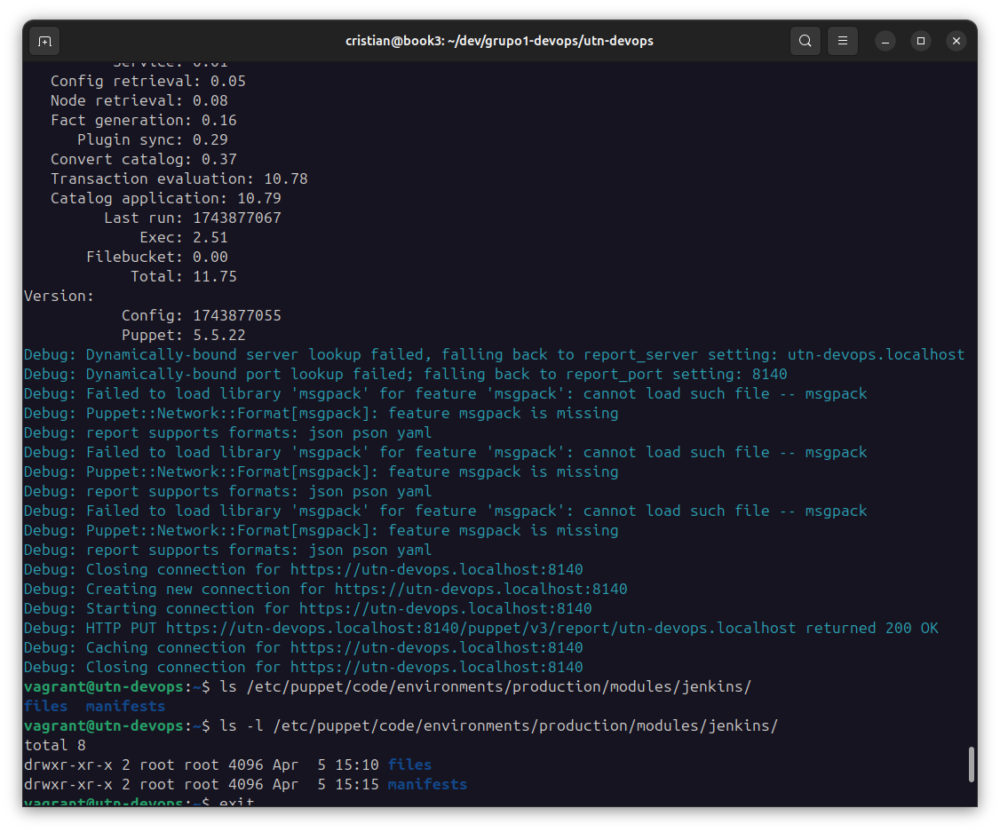
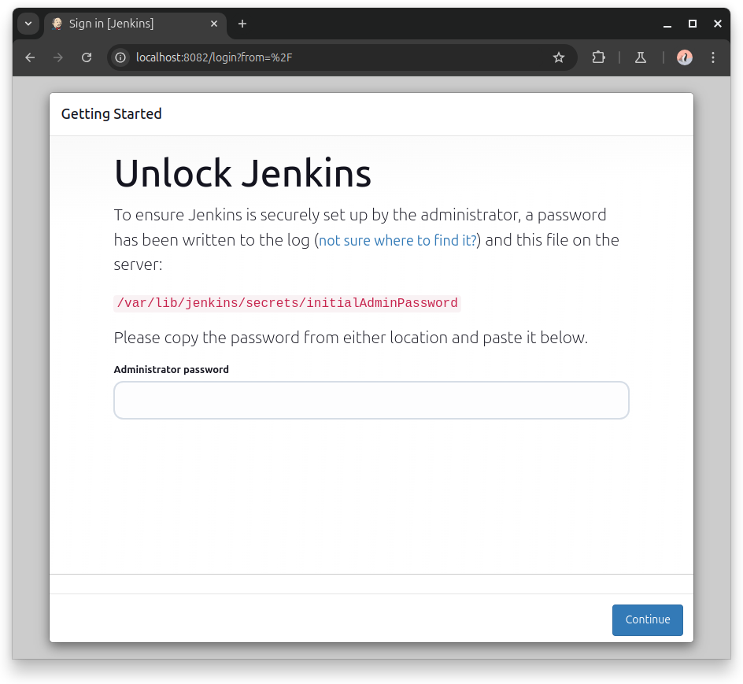
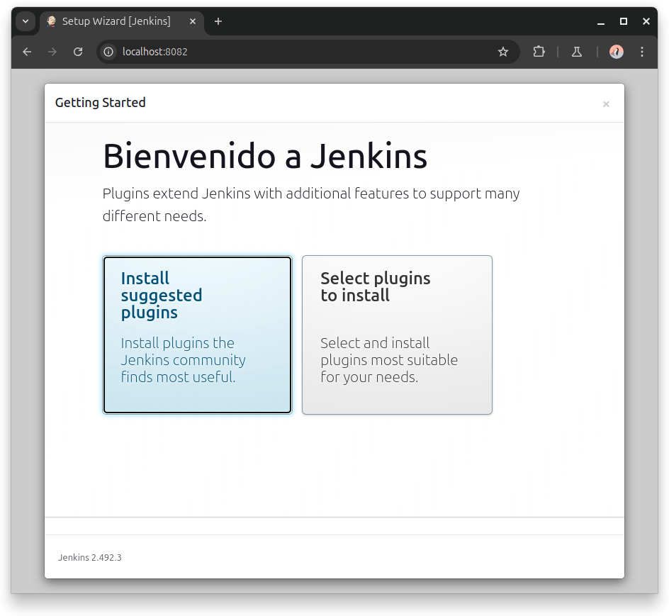
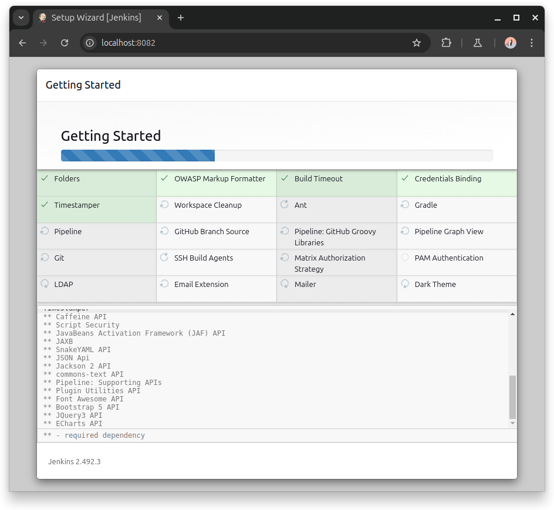
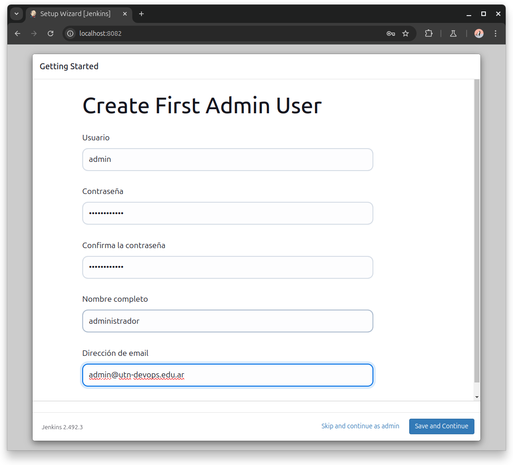
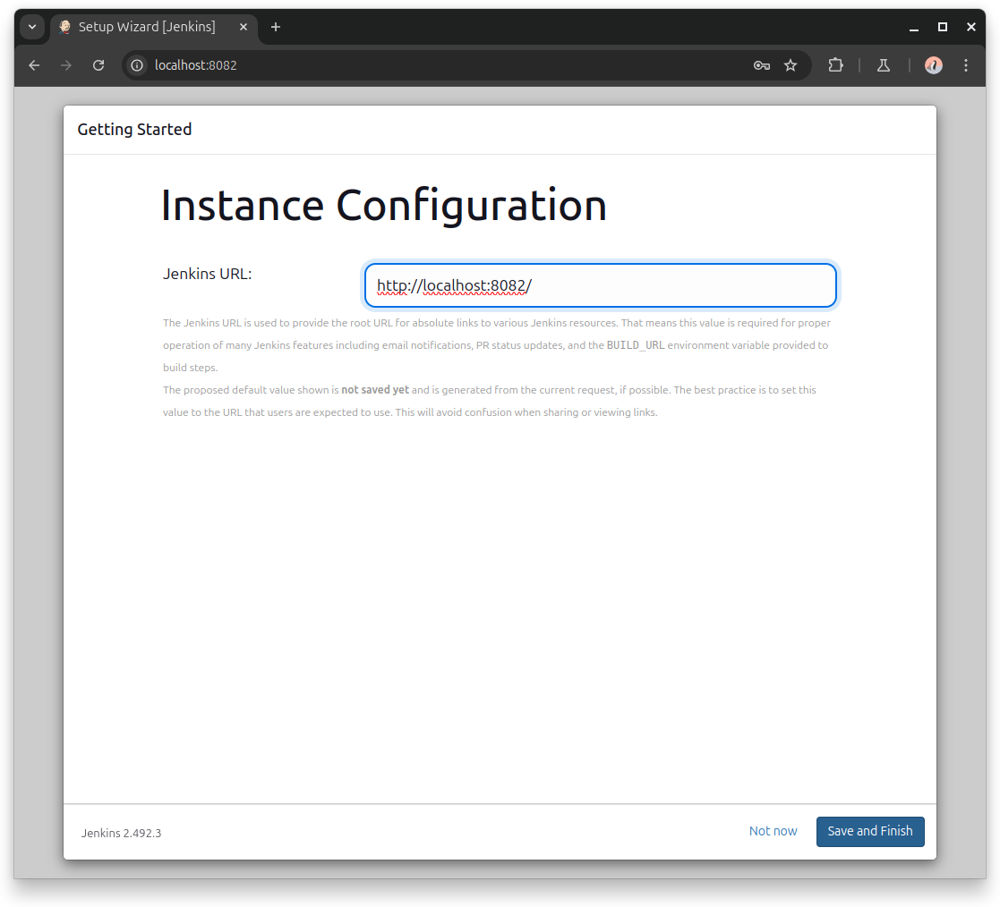
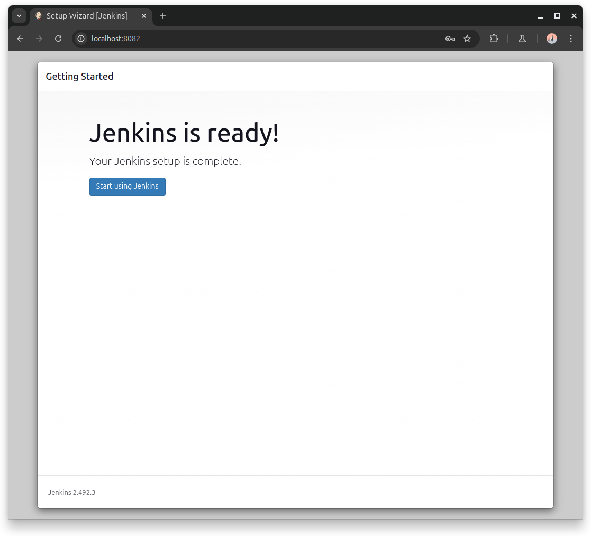
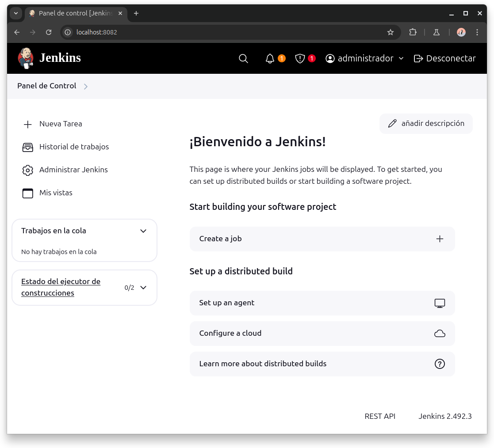

# utn-devops - Grupo 1


## Unidad 3 - Puppets

> [!NOTE]  
> Se ha optado por la práctica detallada con algunas modificaciones.


## Requerimientos
- [Vagrant](https://developer.hashicorp.com/vagrant/install?product_intent=vagrant)
- [Virtualbox](https://www.virtualbox.org/wiki/Downloads)
- [Git](https://git-scm.com/downloads)

## Instrucciones

### 1) Luego de instaladas las dependencias, preparar el directorio de trabajo:

```bash
mkdir grupo1-devops
cd grupo1-devops
```

### 2) Descargar el repositorio de aprovisionamiento:

```bash
# Repositorio que contiene script de aprovisionamiento
git clone https://github.com/kity-linuxero/utn-devops.git
```

### 3) Cambiar de directorio 
```bash
cd utn-devops
```

### 4) Cambiar al branch correspondiente*

```bash
git switch unidad-3-puppet
```


### 5) Ejecutar el siguiente comando para aprovisionar la VM con Vagrant:

```bash
vagrant up
```

### 6) Una vez finalizado el comando, abrimos VirtualBox y debería verse así


### 7) Ejecutar comandos.

Una vez terminado la ejecución de comandos `Vagrant` debemos firmar los certificados para que el agente y el master (instalados en el mismo servidor por cuestiones de simplificar la práctica) se puedan comunicar.

Para eso:

```bash
vagrant ssh

sudo puppet agent -t --debug
```

Al final de la ejecución del `debug` nos indicará el siguiente error:

```bash
Error: Could not request certificate: Error 500 on SERVER: Server Error: can't modify frozen String: ""
Exiting; failed to retrieve certificate and waitforcert is disabled
```

Esto es porque aún no están listos los certificados. Ejecutar lo siguiente:

```bash
sudo puppet cert sign utn-devops.localhost
# Volver a ejecutar el agent debug
sudo puppet agent -t --debug
```

Esta vez debería terminar sin error.


### 8) Verificar archivos de Jenkins

Dentro de la máquina virtual ejecutar lo siguiente para verificar que los archivos de Jenkins se hayan copiado:

```bash
ls -l /etc/puppet/code/environments/production/modules/jenkins/

total 8
drwxr-xr-x 2 root root 4096 Apr  5 15:10 files
drwxr-xr-x 2 root root 4096 Apr  5 15:15 manifests
```




### 9) Abrir el navegador y completar la instalación de Jenkins

- Abrir [localhost:8082](http://localhost:8082)
- Si todo va bien debería verse así:




Ahí nos solicita que peguemos la contraseña de administrador que está en el archivo `/var/lib/jenkins/secrets/initialAdminPassword`

Podemos obtenerla de la siguiente manera:

```bash
vagrant ssh -c "sudo cat /var/lib/jenkins/secrets/initialAdminPassword"
```

Y estamos desde la VM, simplemente hacer:
```bash
sudo cat /var/lib/jenkins/secrets/initialAdminPassword
```

En nuestro caso, la password generada fue: `10e08eef20674a9bacf361dbad21b637`



Luego, ir a **Install suggested plugins”**.

La instalación llevará un tiempo:



Una vez finalizada. Debemos crear el usuario de administrador



Luego, dejamos por defecto la configuración de la instancia de Jenkins.



Si todo sale bien, nos indicará que Jenkins está listo




Una vez, iniciado con las credenciales, podemos ver el Dashboard de Jenkins:



### 9) Detener VM mediante comandos de Vagrant

```bash
vagrant halt
```

Si se desea eliminar la VM

```bash
vagrant destroy
```


