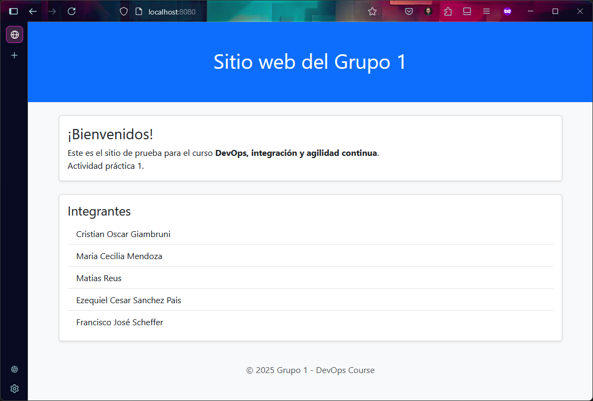

# utn-devops
grupo1-repo-devops

Se ha optado por un sitio web estático, ver mas detalles [aquí](https://github.com/kity-linuxero/devops-web-actividad1).

## Requerimientos
- [Vagrant](https://developer.hashicorp.com/vagrant/install?product_intent=vagrant)
- [Virtualbox](https://www.virtualbox.org/wiki/Downloads)
- [Git](https://git-scm.com/downloads) (opcional)

## Instrucciones

#### 1) Luego de instaladas las dependencias, preparar el directorio de trabajo:

```bash
mkdir grupo1-devops
cd grupo1-devops
```

#### 2) Descargar los repositorios:

```bash
# Directorio que contiene la aplicación
git clone https://github.com/kity-linuxero/devops-web-actividad1.git

# Directorio que contiene el Vagrantfile para aprovisionamiento
git clone https://github.com/kity-linuxero/utn-devops.git
```


#### 3) Cambiar al branch correspondiente:
```bash
cd utn-devops
git switch unidad-1-vagrant
```


#### 4) Ejecutar el siguiente comando para aprovisionar la VM con Vagrant:

```bash
vagrant up
```

#### 5) Una vez finalizado el comando, abrimos VirtualBox y debería verse así


#### 6) Abrir el navegador para verificar

- Abrir [localhost](http://localhost)
- Si todo va bien debería verse así:



#### 7) Detener VM mediante comandos de Vagrant

```bash
vagrant halt
```

Si se desea eliminar la VM

```bash
vagrant destroy
```


