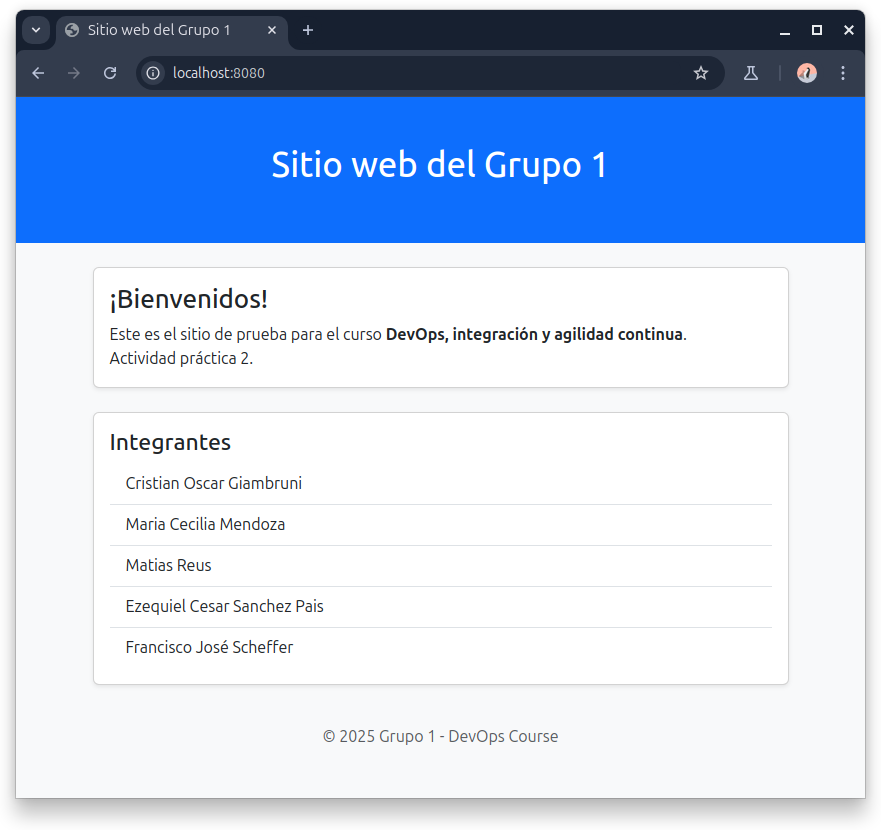

# utn-devops
grupo1-repo-devops

Repositorio de aplicación: [aquí](https://github.com/kity-linuxero/devops-web-actividad1).

> [!NOTE]  
> La aplicación para la actividad práctica N2, se ha optado por la **práctica exploratoria**. Es una aplicación escrita en NodeJS con una base de datos en PosgreSQL. La aplicación lee desde la base de datos el nombre de los integrantes del grupo. La aplicación y la base de datos corren sobre docker en contenedores separados.


## Requerimientos
- [Vagrant](https://developer.hashicorp.com/vagrant/install?product_intent=vagrant)
- [Virtualbox](https://www.virtualbox.org/wiki/Downloads)
- [Git](https://git-scm.com/downloads)

## Instrucciones

### 1) Luego de instaladas las dependencias, preparar el directorio de trabajo:

```bash
mkdir grupo1-devops
cd grupo1-devops
```

### 2) Descargar los repositorios:

```bash
# Directorio que contiene la aplicación
git clone https://github.com/kity-linuxero/devops-web-actividad1.git

# Directorio que contiene el Vagrantfile para aprovisionamiento
git clone https://github.com/kity-linuxero/utn-devops.git
```

### 3) Cambiar de directorio 
```bash
cd utn-devops
```

### 4) Cambiar al branch correspondiente

#### Para la actividad 1:
  ```bash
  git switch unidad-1-vagrant
  ```

#### Para la actividad práctica 2:
  ```bash
  git switch unidad-2-docker
  ```

La estructura de directorios debe quedar de la siguiente manera:

```
grupo1-devops/
├─ devops-web-actividad1/
│  ├─ files and directories...
├─ utn-devops/
│  ├─ files and directories...
│  ├─ Vagrantfile
```


### 5) Ejecutar el siguiente comando para aprovisionar la VM con Vagrant:

```bash
vagrant up
```

### 6) Una vez finalizado el comando, abrimos VirtualBox y debería verse así


### 7) Verificar que los contenedores estén corriendo (Solo actividad práctica 2):

```bash
vagrant ssh -c "sudo docker ps"
```

El resultado de la salida debería ser similar a:

```bash
CONTAINER ID   IMAGE              COMMAND                  CREATED          STATUS          PORTS                                         NAMES
513cc09530da   vagrant-app        "docker-entrypoint.s…"   38 seconds ago   Up 37 seconds   0.0.0.0:8080->3000/tcp, [::]:8080->3000/tcp   grupo1-app
1ca903a53db3   vagrant-database   "docker-entrypoint.s…"   38 seconds ago   Up 37 seconds   5432/tcp                                      postgres-container
```

### 8) Abrir el navegador para verificar

- Abrir [localhost:8080](http://localhost:8080)
- Si todo va bien debería verse así:




Si algo no funciona, puede intentar con

```bash
vagrant reload
```

Si se hacen cambios en el `Vagrantfile` debe intentar:

```bash
vagrant reload --provision
```

### 9) Detener VM mediante comandos de Vagrant

```bash
vagrant halt
```

Si se desea eliminar la VM

```bash
vagrant destroy
```


